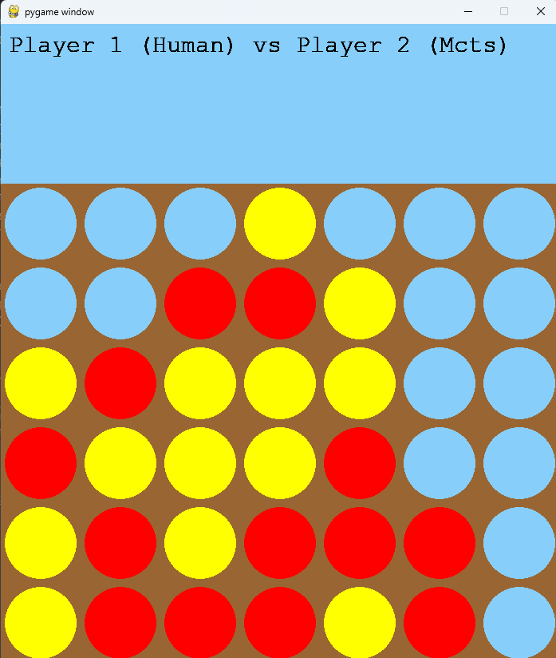

# Connect 4 with AI bots
Connect 4 is a Python implementation of the classic two-player game "Connect 4" with AI-powered bots using **Minimax** and **Monte Carlo Tree Search (MCTS)** algorithms.
Designed for developers, AI enthusiasts, and game lovers, this project provides an engaging way to explore game strategy and decision-making.  

<p align="center">
  
  
  
  
</p>

## Features
**Multiple Player Modes**:  
- Human vs. Human  
- Human vs. AI bots (Minimax or MCTS)  
- AI vs. AI bots (Minimax vs. MCTS, or other combinations)

**Algorithm Implementations**:
- **Minimax**: Uses depth-limited search with heuristic evaluation.
- **Monte Carlo Tree Search**: Employs probabilistic simulations to make strategic moves.

**Dynamic Game Environment**:
- Visualized game board rendered using **Pygame**.  
- Intuitive click-based input for human players.  
- Real-time turn indication and winner announcements.  

**Customizable Settings**:
- Choose AI difficulty by adjusting Minimax depth or MCTS iterations.
- Flexible board size and token colors.
  
  
## Getting Started
**Installation**  
1) Clone the repository:
```
git clone https://github.com/your-username/connect4-ai.git
```

2) Navigate to the project directory:  
```
cd connect4-ai
```

3) Install dependencies:  
```
pip install pygame numpy
```


## How to Play
**Run the Game**
```
python main.py
```

**Game Setup**
When prompted, choose the type of players for **Player 1** and **Player 2**:  
1) Human  
2) Minimax AI  
3) MCTS AI  

The game starts with Player 1’s turn. If Player 1 is a human, click a column to drop your token.

**Gameplay**
- Players alternate turns.  
- The first to align **4 tokens** horizontally, vertically, or diagonally **wins**.  
- If the board is full and no one wins, the game ends in a draw.  


## Code Examples
**Game Configuration**
Adjust AI settings, board size, and visual elements in the Constants module:
```
# Constants.py
ROW_COUNT = 6
COLUMN_COUNT = 7
SQUARE_SIZE = 100
RED = (255, 0, 0)
YELLOW = (255, 255, 0)
BRIGHT_SKY_BLUE = (135, 206, 250)
```

**Using Minimax Algorithm**  
```
minimax_agent = MINIMAXAgent(depth=5, ROW_COUNT=6, COLUMN_COUNT=7, player=1)
best_move = minimax_agent.bestMove(current_board)
```
**Using MCTS Algorithm**  
```
mcts_agent = MCTSAgent(num_iterations=4000, ROW_COUNT=6, COLUMN_COUNT=7, player=2)
best_move = mcts_agent.monte_carlo_tree_search(current_board)
```

## Tech Stack
- Languages: Python
- Libraries:
  - Pygame: For game visualization and user interaction.
  - NumPy: For efficient board state manipulation.
- **AI Algorithms**:
  - **Minimax with Alpha-Beta Pruning**: For deterministic decision-making.
  - **Monte Carlo Tree Search (MCTS)**: For probabilistic exploration.


## Contributing
Contributions are welcome! Here's how you can contribute:
- Fork the repository.
- Create a new feature branch.
- Commit your changes and write clear commit messages.
- Push your changes and open a pull request.

## License
This project is licensed under the MIT License. See the LICENSE file for details.
